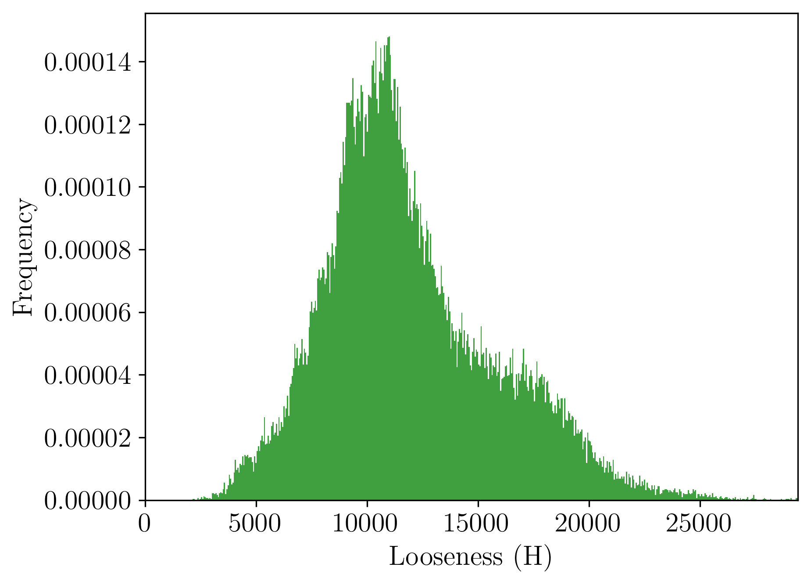
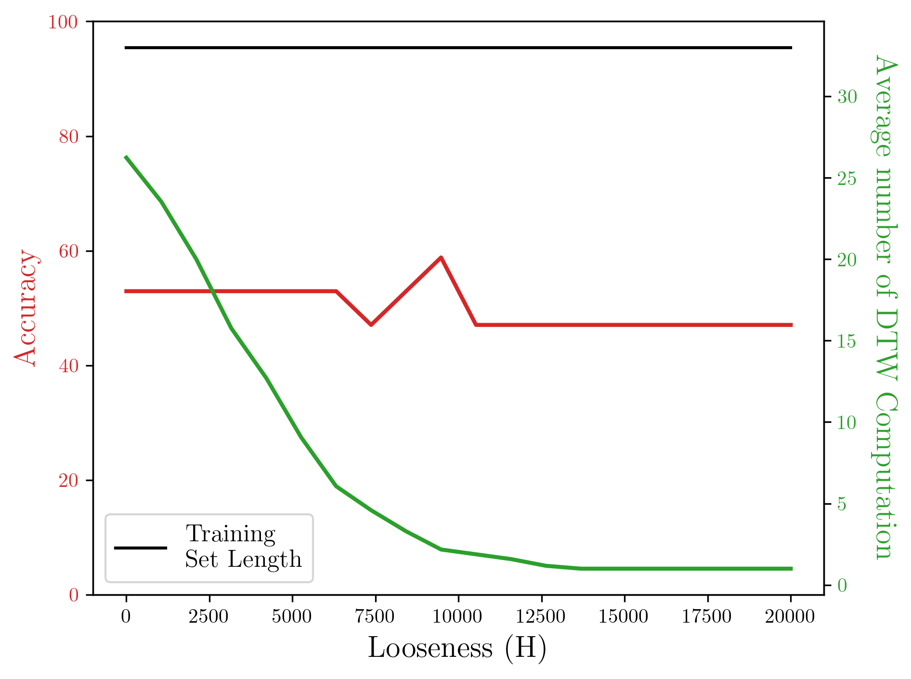

.. _DTW:

Dynamic Time Warping (DTW)
==========================

.. image:: figures/DTW_Animation.gif
   :class: with-shadow float-center
   :scale: 70

.. automodule:: DTW.DTW_Pipeline
    :members:

::

    # generate two time series
    ts1 = np.linspace(0,6.28,num=100)
    ts2 = np.sin(ts1) + np.random.uniform(size=100)/10.0
    
    # compute the distance between and the plot the warping path
    distance = DTW_Distance_Comp(ts1,ts2,5,True,False)
    
    # generate synthetic data set
    
    TS1 = []
    for i in range(15): 
        fs, T = 100, 10 
        t = np.linspace(-0.2,T,fs*T+1) 
        A = 20 
        TS1.append(A*np.sin((i+1)*np.pi*t) + A*np.sin(1*t))
    
    # serial distance computation
    DM1 = DTW_Dist_Mat(TS1,False,False)
    # parallel distance computation
    DM2 = DTW_Dist_Mat(TS1,False,True)
    
    # Generate the second set of time series so that we can apply transfer learning
    TS2 = []
    for i in range(20): 
        fs, T = 100, 10 
        t = np.linspace(-0.2,T,fs*T+1) 
        A = 20 
        TS2.append(A*np.sin((2*i+1)*np.pi*t) + A*np.sin(2*t))   
    
    # serial distance computation
    DM_TF1 = DTW_Dist_Mat(TS1,True,False,TS2)
    # parallel distance computation
    DM_TF2 = DTW_Dist_Mat(TS1,True,True,TS2)    
    
    # perform classification
    labels1 = np.random.choice([0, 1], size=(len(TS1),), p=[1./3, 2./3])
    out = TS_Classification(1,TS1,labels1,DM1,False)
    
    # perform classification using transfer learning
    labels2 = np.random.choice([0, 1], size=(len(TS2),), p=[1./3, 2./3])
    out = TS_Classification(1,TS1,labels1,DM_TF1,True,TS2,labels2,DM_TF2)

AESA Example

::

    # Generate the second set of time series so that we can apply transfer learning
    TS3 = []
    for i in range(50): 
        fs, T = 100, 10 
        t = np.linspace(-0.2,T,fs*T+1) 
        A = 20 
        TS3.append(A*np.sin((2*i+1)*np.pi*t) + A*np.sin(2*t))  
    labels3 = np.random.choice([0, 1], size=(len(TS3),), p=[1./3, 2./3])
    # parallel distance computation
    DM3 = DTW_Dist_Mat(TS3,False,True)
    
    # Check if there is any violiation to triangular inequality
    H = TriangularInequalityLoosenes(DM3) 
 
    # plot the loosenes constants
    plt.figure()
    fig = plot_Looseness_Constants(H)
    plt.show()
	

::
  
    # define a range for the H value 
    H_range = np.linspace(0,20000,20)

    # run the AESA for each value in H_range
    output=[]
    for i in H_range:
        output.append(AESA_Classification(TS3,labels3,i,DM3,100))
        
    #plot the results
    plt.figure()    
    plot_AESA_results(output,H_range)
    plt.show()   
	

